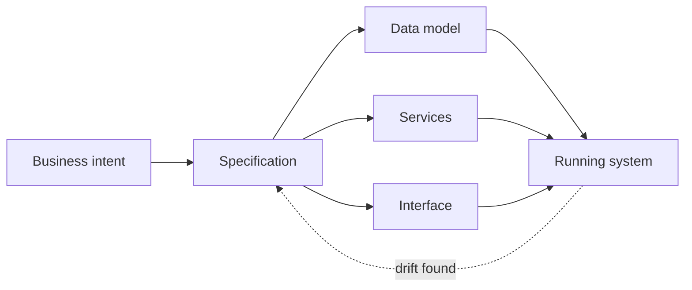
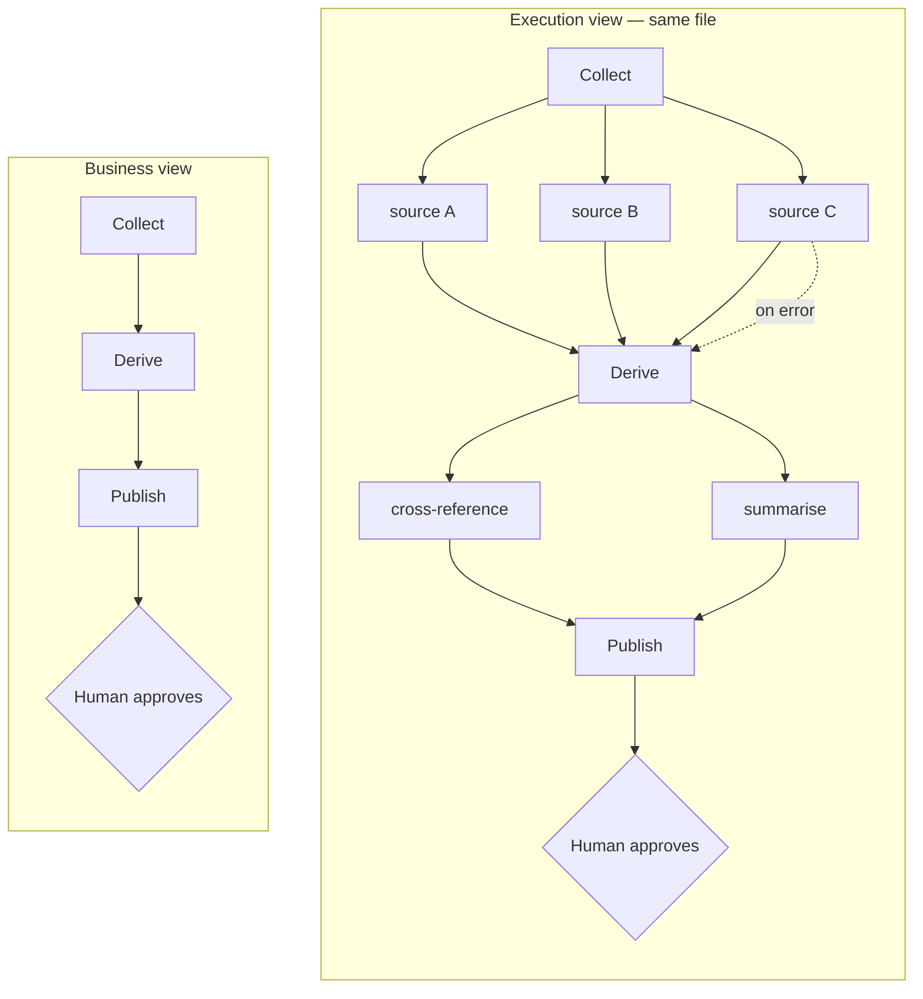
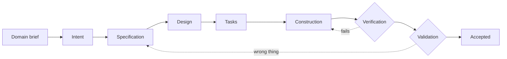
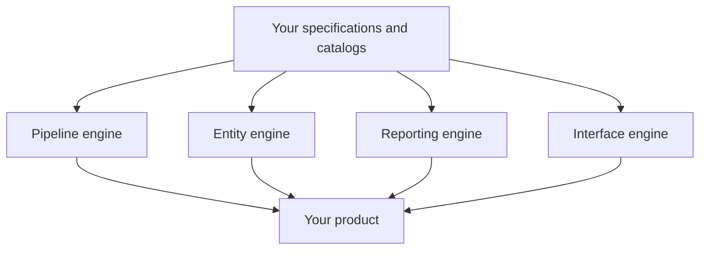
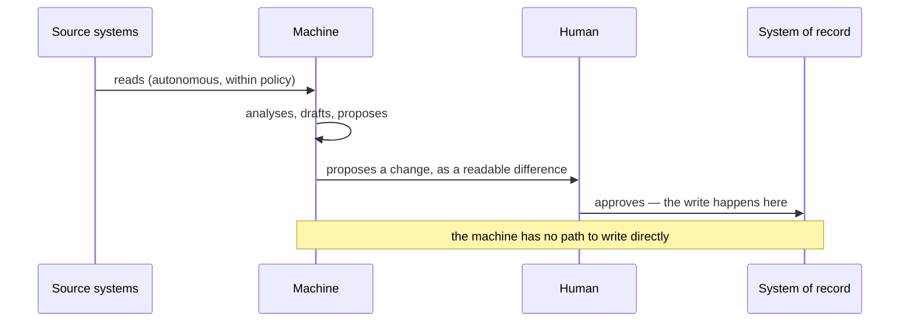
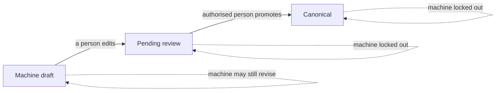

## From Intent to Accepted {layout=title}
AI-orchestrated delivery with human gates — where the machine does the work, and every decision that changes anything stays with a named person.

**spec-driven** · **human-gated** · **document-native**

## Where delivery leaks {layout=cards label="The case"}

### :quotes: Translation loss {accent=red}
What the business meant becomes a ticket, becomes a guess, becomes code. Nobody can point at where the meaning changed.

### :file-text: Documents that rot {accent=red}
The specification described the system on the day it was signed. The system moved. Now the document misleads more than it helps.

### :code: Logic only readable as code {accent=red}
Answering “what does it do when X?” takes a developer and an afternoon — every time you ask.

### :lightning: AI that outruns review {accent=red}
Assistants generate more code than anyone can read. Volume grew; review capacity did not.

---

These are not four problems. They are one: **the thing that executes and the thing people can read are two different things.**

## AI is the centre of work. The human is the centre of control. {layout=cards label="The idea"}

### :robot: The machine {accent=blue}
Reads everything, tirelessly. Drafts, builds, proposes. Never sleeps, never bored.

### :user-circle: The human {accent=green}
Decides what matters. Reviews and accepts. Owns the consequence.

---

Not supervision — **gates**. Supervision means watching everything and catching what you can. A gate means nothing passes without a named person, and the machine cannot open it.

## Four claims — everything after this is evidence {layout=cards label="The thesis"}

### :flow-arrow: The chain is controlled end to end {accent=blue}
Every step from intent to accepted produces an artefact and passes a named human. “Done” is verification, then validation.

### :file-text: Business logic lives only in documents {accent=mauve}
Never in code — at runtime too. A refactor cannot silently change a business rule, because the rule is not in the code.

### :eye: Transparent code, no hidden logic {accent=teal}
No clever code, no black box, no implicit fallback. Declared, or it fails loudly.

### :tree-structure: The workflow is the document {accent=peach}
The artefact you review, the artefact you present, and the artefact that executes are the same artefact.

## There is a written contract — and it outranks everything {layout=cards label="The rules · level 1"}

### :target: One source of truth (A1) {accent=blue}
Every fact lives in exactly one place.

### :file-text: Doc = Code (A2) {accent=blue}
The document is the build input, not a description of it.

### :database: No hardcoding (A3) {accent=blue}
Identity and configuration are declared — or it fails loudly.

### :gear: Generic engine (A4) {accent=blue}
Logic lives in specifications; engines just interpret them.

### :stack: Data → back → front (A5) {accent=blue}
Never hand-write below what a document owns above.

### :handshake: AI works, human controls (A6) {accent=blue}
Reads are free; every write is gated.

### :quotes: Markdown + English (A7) {accent=blue}
Logic in readable documents, not compiled artefacts.

### :list-checks: Spec before code (A8) {accent=blue}
No implementation begins without a committed specification.

### :check-circle: Verified, human-owned done (A9) {accent=blue}
Compilation is not done. Two gates, two people.

### :git-branch: Smallest diff (A10) {accent=blue}
The small change is the unit of safety, review and revert.

### :chat-circle-dots: Propose, then the human directs (A11) {accent=blue}
The machine never silently self-solves.

### :lightbulb: Why it matters {accent=lavender}
Not the list — the fact that a contract **exists**, outranks every other rule, and you can read it.

## The same contract, as promises to you {layout=cards label="The rules · what they buy you"}

### :eye: You can read what you bought {accent=green}
The logic is documents in your language, not a codebase you must hire to interpret.

### :target: One place per fact {accent=green}
A change lands once and propagates. There is no second copy to forget.

### :magnifying-glass: Nothing hidden in the build {accent=green}
Identities, endpoints and thresholds are yours to see and to set.

### :lightning: Change is cheap by construction {accent=green}
New behaviour is a catalog entry, not a new system.

### :check-circle: Nothing ships without your acceptance {accent=green}
Two gates — and the business one is yours.

### :lock: The machine never widens its own rights {accent=green}
Approvals and secrets are human-only by design.

### :flow-arrow: The process you are shown is the process that runs {accent=green}
No second copy of the truth to maintain, and none to go stale.

### :books: Knowledge stops walking out the door {accent=green}
It becomes a versioned, attributable asset your experts own.

## Doc = Code — the specification is the build input {layout=mermaid diagrams=first label="The mechanic"}

One direction. If the code disagrees with the specification, **the specification wins and the code is regenerated** — never the reverse. That is what stops documents from rotting: a stale document is not untidy, it is a *broken build input*, so it gets fixed like one.

## What a specification actually contains {layout=table label="The artefact"}

| Document | Answers | Who reads it |
|---|---|---|
| **Brief** | Why, and for whom | Business |
| **Requirements** | What, testably | Business + delivery |
| **Design** | How | Delivery |
| **Tasks** | What is done, what is not | Everyone |
| **Audit** | Residual risk, and who accepted it | Business + audit |

---

Committed **before** the first line of code — that is a hard gate, not a preference. And requirements are written to be checkable: *“When a source is unreachable, the panel shall show the last known state and when it was captured”* — not “the system should be robust”.

## The workflow is the document {layout=mermaid diagrams=first label="Workflow = document"}

Nothing was redrawn for this meeting. **Both pictures are generated from the file that runs.** The process documentation cannot drift from the process, because it is not a separate thing.

## How a project starts — two intakes, one artefact {layout=cards label="Before the specification"}

### :file-text: A requirement exists {accent=sky}
You state a need. Open research supplies the context nobody wrote in the brief: the regulation that constrains it, the published formats and standards, the counterparts to integrate with, the deadlines imposed from outside.

### :lightbulb: A solution exists {accent=sky}
The question is which organisation it fits. Research runs over the target’s public surface — published rules, registries it operates, stated obligations — and yields a fit assessment: what is answered, what must grow, what is out of scope.

### :quotes: Every claim sourced {accent=teal}
The brief is evidence, not opinion. Any line can be checked.

### :eye: Public material only {accent=teal}
Nothing behind a login, nothing from a protected system.

### :hand: Machine collects, human scopes {accent=teal}
The gate is at the *start* of the chain, not only at the end.

---

Your first requirements workshop does not start with a blank page. It starts with a researched brief about your own domain, every claim sourced — and your job in that meeting is to correct it and decide scope, not to dictate it from memory.

*This is how we work today — expert practice, not an automated product feature.*

## The chain, from intent to accepted {layout=mermaid diagrams=first label="Controlled chain"}

Every arrow is an artefact. Every diamond is a **named human**. Nothing advances because someone said it was fine.

## Two gates — and neither one alone is done {layout=table label="What “done” means"}

| | Verification | **Validation** |
|---|---|---|
| **Asks** | Built it **right**? | Built the **right thing**? |
| **Evidence** | Automated checks pass *and* a human read the change | It does the business job, at acceptable performance |
| **Who** | Delivery | **You** |
| **Fails when** | A test breaks, a reviewer objects | It works — and it is not what was needed |

---

**Compilation is not done. A demo is not done.** The most expensive failure in this industry is a system that passed every technical check and solved the wrong problem.

## Who may do what {layout=table label="Transparent code · the boundary"}

| Action | Machine | Human |
|---|---|---|
| Read within declared policy | ✅ autonomous | — |
| Draft, propose, prepare a change | ✅ yes | — |
| **Write anything** | ❌ never unattended | ✅ approves |
| Unlock a secret | ❌ by design, no | ✅ only |
| **Grant itself more rights** | ❌ structurally impossible | ✅ only |

---

The last row is the one that matters. The machine cannot widen its own permissions — **not because it was told not to, but because the path does not exist for it.**

## Generic engines, extended by catalogs — never a new engine per project {layout=mermaid diagrams=first label="Why change stays cheap"}

**The fifth feature costs a configuration entry, not a project.** The system does not get more expensive to change as it grows — which is the opposite of what everyone in this room has experienced.

## One example, end to end {layout=table label="Delivery leg · worked"}

| Step | What happened | Gate |
|---|---|---|
| **Brief** | Public market rules, mandated formats, counterpart list — researched, sourced | Analyst scoped it |
| **Specification** | The variance *between counterparts* absorbed into the document | Business reviewed |
| **Construction** | Data model → services → screens, generated from the specification | — |
| **Verification** | Checks green, change reviewed | Delivery signed |
| **Validation** | Real files exchanged with the real counterparts | ✅ Client accepted |

---

The counterpart differences live in a document a business person can read and amend. **They were never a pile of special cases inside the code.**

## The same shape — in production {layout=cards label="The runtime leg"}

### :package: Not a box that contains AI {accent=mauve}
The delivered product runs **declared workflows**. Steps are documents; the engine is generic; the run is observable.

### :stack: One workflow, two altitudes {accent=mauve}
What the business signed off, and what actually executed — timings, counts and failures attached to the same boxes you approved.

---

This is why the method is a **product property, not a team habit**. The discipline does not stop at handover; it is how the thing you bought behaves every night.

## Business logic at runtime — a rule change is an edit, not a release {layout=table label="Logic in documents"}

| Conventional | **This** |
|---|---|
| Rule inside the code | Rule is a **row your expert edits** |
| Threshold as a constant | Threshold in a catalog, with history |
| Prompt buried in a binary | Prompt is a reviewable document |
| Change = ticket → sprint → release | Change = **an edit, reviewed, effective** |

---

Detection rules, term lists, categories, prompts, personas, thresholds — curated data, human-editable, versioned. **A rule baked into the code as a literal is treated as a defect here, not a shortcut.** That is a written rule, not an aspiration.

## The runtime gate — the machine proposes, a person approves {layout=mermaid diagrams=first label="Controlled chain · in production"}

Reads are autonomous. **Writes are never self-approved.** The proposal arrives as a difference a person can read — not as an action already taken and reported afterwards.

## Grounded answers — and an honest “I don’t know” {layout=cards label="Trust in the runtime"}

### :quotes: Answers cite sources {accent=teal}
You can open what the answer was built from, and judge it yourself.

### :x-circle: Refusal over invention {accent=teal}
When the corpus does not support an answer, the correct output is “I don’t know”.

### :graph: Connections are visible {accent=teal}
Relationships between documents are a navigable graph, not a hidden index — you can see *why* two things were linked.

---

A missing answer is information: **it names a gap someone should fill.** A system that always answers is a system that cannot tell you where its knowledge ends.

## Evidence and audit {layout=cards label="Transparent code · attributability"}

### :user-circle: Who {accent=lavender}
The named person who approved it.

### :clock: When {accent=lavender}
The moment, recorded by the system, not typed by hand.

### :check-circle: On whose approval {accent=lavender}
The gate that let it through.

### :git-branch: Against which version {accent=lavender}
Of which document — the rule as it stood at that moment.

---

That is one **record**, not a reconstruction. It is the difference between “we believe the system did the right thing” and **“here is the trail”**.

## One example, in production {layout=table label="Runtime leg · worked"}

| Step | What happened |
|---|---|
| **Read** | The machine inventoried a live estate, continuously, read-only |
| **Compare** | Measured it against declared policy and published vulnerability data |
| **Propose** | Produced a specific change per machine, as a readable difference |
| ✅ **Gate** | **A named engineer approved — nothing was applied without it** |
| **Record** | Every applied change attributable to a person and a moment |

---

The machine did the work no human has time for. **The human made every decision that changed anything.**

## Knowledge that leaves with people {layout=cards label="The flywheel"}

### :calendar: Today {accent=red}
The answer lives in someone’s head, a chat thread, or a ticket comment. It is not searchable, not attributable — and it walks out on their last day.

### :books: The encyclopaedia insight {accent=green}
Knowledge becomes an **asset** only when it is written, versioned, attributable and open to correction.

---

Everyone already understands the model: anyone can propose an edit, every version is kept, an editor decides what becomes canonical, and every claim carries its source. **That is the whole explanation — no technical vocabulary required.**

## Three roles, one corpus — with different rights {layout=table label="The flywheel · the roles"}

| Role | Does | May not |
|---|---|---|
| **Agent** | Reads your source systems, drafts articles, keeps the corpus fresh | ❌ Publish; touch what a human has edited |
| **Librarian** | Answers from the promoted corpus with citations; surfaces gaps and contradictions | ❌ Invent an answer the corpus does not support |
| **Helper** | Explains the product in context — select anything, ask what it is | ❌ Change anything without the usual gate |

---

**The user manual is not a deliverable.** Product help is answered from the same corpus as everything else — so it cannot go stale relative to the product.

## The promotion gate {layout=mermaid diagrams=first label="The flywheel · the mechanism"}

- The machine's write path exists **only** where the article is still a draft **no human has touched**.
- Promotion **fails closed**: no authority, no promotion. Every version is retained, with author and timestamp.

> :shield: The machine cannot overwrite anything a human has touched. That is not a policy we wrote in a prompt and hope it follows — it is a condition in the database. The model does not get a vote.

## Regulated energy-sector data exchange {layout=cards label="Examples · delivery"}

### :warning: Problem {accent=peach}
Mandated data exchange with many counterparts, each interpreting the same rules differently, against externally imposed deadlines.

### :file-text: Specification {accent=peach}
Counterpart variance captured as declared data — not as branches in code.

### :package: Built {accent=peach}
Data model, exchange services and operator screens, generated from the specification.

### :hand: Gate {accent=green}
Client accepted against real exchanges with real counterparts.

---

**Outcome:** a new counterpart, or a changed format, is a document edit under review.

## Enterprise knowledge assistant {layout=cards label="Examples · runtime"}

### :warning: Problem {accent=sky}
A large, sensitive corpus. Answers needed with provenance — not plausibility.

### :file-text: Specification {accent=sky}
Classification and handling rules declared as curated data the business owns.

### :package: Built {accent=sky}
Ingestion pipelines, retrieval with citations, an assistant running inside the customer's boundary.

### :hand: Gate {accent=green}
Subject-matter experts accept what becomes canonical.

---

**Outcome:** the rules deciding how sensitive material is treated are edited by the business — not by developers.

## Infrastructure fleet operations {layout=cards label="Examples · the runtime gate"}

### :warning: Problem {accent=mauve}
A large estate under continuous compliance and vulnerability pressure, with no capacity to inspect everything.

### :file-text: Specification {accent=mauve}
Policy and comparison logic declared; the engine stays generic.

### :package: Built {accent=mauve}
Read-only inventory, compliance comparison, per-machine change proposals.

### :hand: Gate {accent=green}
Every change applied only on a named engineer's approval.

---

**Outcome:** full-estate awareness without granting a machine the right to change anything.

## Public-sector knowledge base {layout=cards label="Examples · the flywheel"}

### :warning: Problem {accent=teal}
Expertise concentrated in a few people. Questions repeat; answers are inconsistent.

### :file-text: Specification {accent=teal}
Article lifecycle, statuses and the promotion gate declared as the data model itself.

### :package: Built {accent=teal}
Ingestion from existing systems, drafted articles, a librarian assistant, an editor surface.

### :hand: Gate {accent=green}
An expert promotes; the machine is locked out of anything a human touched.

---

**Outcome:** knowledge becomes a maintained asset, with a revision history and named authors.

## Why this beats the alternatives {layout=table label="The comparison"}

| | Custom development | Low-code platform | AI assistant on a normal project | **This** |
|---|---|---|---|---|
| **Business logic lives** | in the code | in vendor config | in the code, written faster | **in documents you own** |
| **Who can read it** | developers | vendor-skilled | developers | **your analyst** |
| **A rule change costs** | ticket → sprint → release | vendor-shaped | same as custom | **a reviewed edit** |
| **Refactoring risk** | can silently alter behaviour | opaque | higher | **nil for business rules** |
| **“Done” means** | varies by team | vendor sign-off | often “it compiles” | **verification, then your acceptance** |
| **Hidden defaults** | accumulate | black box | inherited | **none — declared or it fails loudly** |
| **Process documentation** | drifts | partial | drifts faster | **cannot drift** |
| **Exit** | rewrite | migration project | rewrite | **the documents leave with you** |
| **When the model changes** | — | — | rework | **specs unchanged, output regenerated** |

## The three questions you were going to ask {layout=cards label="Answered before you ask"}

### :shield: Where does my data go? {accent=green}
**It stays inside your boundary.** Database, pipelines, retrieval and interfaces run on your infrastructure. The language model is the only component that can sit outside — and it does not have to: with a local model, nothing leaves at all.

### :warning: What if the machine is wrong? {accent=yellow}
It is sometimes; the design assumes it. Being wrong is **cheap and visible** — a wrong draft fails review, a wrong proposal is declined, a wrong answer is caught by its citation. What cannot happen is a wrong **silent** change. The failure mode is wasted review effort, not a corrupted system.

### :cloud: What if the model or vendor changes? {accent=blue}
The specifications are the asset, and they are plain documents. The model is an interchangeable component: when a better one arrives, the specifications are unchanged and the output is regenerated.

## What it costs, and who does the work {layout=cards label="The honest shape"}

### :rocket-launch: Heavy at the start {accent=peach}
Intake research and specification. This is where your people are needed most — and where the value is decided.

### :gear: Light in construction {accent=green}
The part that used to dominate the budget.

### :eye: Constant at review {accent=blue}
And this never goes away. It is the price of control.

---

### :hand: What you supply {accent=lavender}
Someone who owns the intent · someone who accepts against the business goal · a subject-matter expert where a knowledge corpus is involved.

### :x-circle: What you do not supply {accent=lavender}
People to write the parts a document already describes.

## What changes — and what never does {layout=cards label="A live technology, a stable contract"}

| Layer | Rate of change | Owned by |
|---|---|---|
| **The base rules** | ❌ Never — a change here is a change of promise | Us, in writing, readable by you |
| The method | Slowly; the shape has held across every project | Us |
| The tooling, engines, models | **Continuously** — improves month over month | Us, invisibly to you |
| **Your product** | ✅ Only when **you** decide | **You** |

### :rocket: Coming {accent=blue}
Repeatable intake research · richer workflow views · the knowledge flywheel as a standard component · demonstrated model independence.

### :x-circle: Never {accent=red}
Business logic back in code · a hidden default · a machine that approves its own write · a format you cannot read and take with you.

---

The layer that moves fastest is the one **furthest from your product**. The layer that never moves is the one you are actually buying.

## What you get — and what you must supply {layout=cards label="Close"}

### :package: You get {accent=green}
Logic you can read, in your language. An audit trail that is a record, not a reconstruction. Change priced as an edit, not a project. An exit that exists from day one.

### :hand: You supply {accent=peach}
Someone who owns the intent. Someone who accepts against the business goal. Expert review where knowledge is involved. The willingness to decide rather than delegate.

---

> We are not selling you more output. We are moving your people from writing to deciding — and the honest version of that is: if you cannot name who will review and accept, do not buy this.
