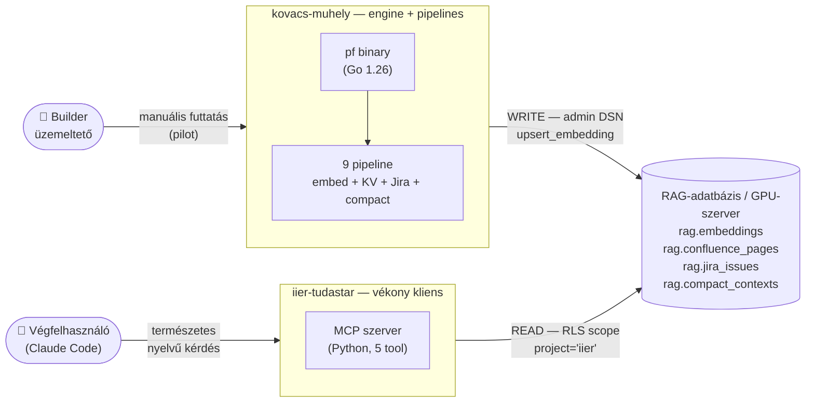
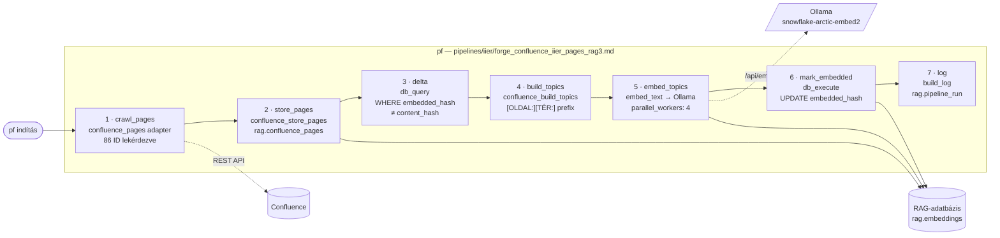

## kovacs-muhely {layout=title}
A IIER tudástár builder-oldali eszköztára — pipeline-forge engine, embedding pipeline-ok, üzemeltetői szkriptek

Builder · pipeline-forge · pgvector · Confluence · SharePoint · Pilot

## Két projekt, egy adatbázis — ki mit tesz? {layout=free diagrams=first label="Pozicionálás"}

### A toolkit (ez a projekt) {accent=lavender}
**kovacs-muhely**

- Builder/üzemeltető használja
- Pipeline szerkesztés, embed futtatás
- Új tenant scaffold, build verifikáció

### A vékony kliens (testvér repo) {accent=mauve}
**iier-tudastar**

- Végfelhasználó telepíti Claude Code-ba
- 5 MCP tool olvasáshoz
- RLS-izolált tenant role

### A közös backend {accent=green}
**RAG-adatbázis (GPU-szerver)**

- pgvector — 1024d embeddings
- `project='iier'` — RLS izoláció
- Builder ír, end user csak olvas



## Mi van a dobozban? {layout=cards label="A toolkit tartalma"}

### :cpu: Engine {accent=sapphire}
- `bin/pf` — pipeline-forge CLI
- Go 1.26.0, statikus binary, ~17 MB
- Commitálva — deploy hosztnak nem kell Go
- 24 adapter beépítve (confluence, embed_text, db_query, build_log, parallel, …)

### :list-checks: Pipeline-ok {accent=mauve}
- `pipelines/iier/` — 9 pipeline (4 embed + KV + Jira + 2 compact + bge-only)
- `pipelines/search_*.md` — 2 retrieval-validációs pipeline
- Mind .md fájl — szerkeszthető, verziózható
- Embed: írva itt (authoritative); search: `iier-tudastar/pipelines/`

### :code: Python helper {accent=peach}
- `sources/sharepoint.py` — NTLM + DOCX szakasz-kinyerés
- `sources/base.py` — adapter ősosztály
- `core/{logger,sanitizer}.py` — strukturált log + PII szűrés
- A shell adapter hívja a SharePoint pipeline-ból

---

### :hard-drives: Builder szkriptek {accent=green}
- `run_embed.sh` — pipeline futtató wrapper
- `scripts/rag_status.sh` — utolsó pipeline futások
- `scripts/rag_counts.sh` — chunk-számok
- `scripts/new_tenant.sh` — új tenant scaffold

### :gear: Config & ütemezés {accent=yellow}
- `config.yaml` — search default-ok
- `.env.example` — minden env var dokumentálva
- `metadata.schedule:` — a pipeline-ok fejléce szabályozza

### :magnifying-glass: Visszakeresési QA {accent=blue}
- `/km-search` · `/km-search-iier2` — `bin/pf` futtatja a kereső pipeline-t
- Builder-oldali QA, nem prod
- Embed után „hozzáférhető-e visszakeresve?” ellenőrzéshez
- A helyi QA MCP szerver 2026-07-31-én megszűnt; a végfelhasználói MCP felület a `/mcp/iier2`

## 9 pipeline — embed, KV, Jira, compact {layout=split label="Pipeline állomány" align=top}

### Aktív — kurált oldalak {accent=green}
**forge_confluence_iier_pages_rag3**

- 86 célzott Confluence oldal, explicit `page_ids:`
- 4 al-fa: I.1 SAPS · I.2 Vis maior · I.3 IIER2 segédlet · I.4 Térinformatika
- Delta mód: `embedded_hash IS DISTINCT FROM content_hash`
- Dual-model: snowflake-arctic-embed2 + bge-m3 párhuzamosan

`trigger: manual` · `86 ID`

### Aktív — DOCX library {accent=peach}
**forge_sharepoint_docx_rag3**

- SharePoint NTLM, IIER intranet — `/iier/ITdocs/Docs`
- Szakaszérzékeny: `[CÍM:][FEJEZET:]` magyar prefix
- Python helper: `sources/sharepoint.py` a shell adapteren át
- Dual-model: snowflake + bge-m3; `doc_modified_at` traceability

`schedule: 0 3 * * *` · `pilot — manual ma`

---

### Aktív — tábla-kinyerő (pages után) {accent=teal}
**forge_doc_kv_iier_confluence_rag3**

- 86 kurált oldal pipe-delimited tábláinak kinyerése
- Output: `rag.document_eav` (sorok) + `rag.embeddings` (tábla-összefoglaló)
- Dual-model embed: snowflake + bge-m3 párhuzamosan
- Előfeltétel: pages pipeline lefutott

`trigger: manual` · `631 tábla · 3 906 sor`

### Aktív — kompakt kontextusok (embed után) {accent=sky}
**forge_compact_iier_rag3 + bge**

- Hasonló topicok klaszterezése `rag.compact_contexts`-be
- Két változat: snowflake + bge-m3
- `search_compact` MCP tool ezt kérdezi le
- Tenant-izolált: `(project, collection, topic)` UNIQUE

`trigger: manual`

### Aktív — Jira issue-ok (IIER2ELES + IIERDB) {accent=yellow}
**forge_jira_iier_rag3**

- JQL: `project in (IIER2ELES, IIERDB)`, 2025+ aktív issue-ok
- ~25 K issue, `jira_issues` adapter, delta hash gate
- Dual-model: snowflake + bge-m3 párhuzamosan
- Előfeltétel: migration 020 alkalmazva RAG-adatbázis-re

`trigger: manual` · `jira_issues adapter · migration 020`

## Orchestrator, letiltott template, számok {layout=split label="Pipeline állomány" align=top}

### Orchestrator {accent=sapphire}
**forge_confluence_iier_rag3**

- Pages + Spaces al-pipeline párhuzamosan (`type: parallel`)
- Két-szintű parallelizmus: branch + `parallel_workers: 4` az embedben
- DB-szintű no-overlap: `ON CONFLICT … DO UPDATE`
- Pages branch ma fut, spaces fail-safe (üres template)

### Letiltott — template {accent=red}
**forge_confluence_iier_spaces_rag3**

- Üres `spaces:` — szándékos fail-safe
- Termékfelelősi jóváhagyás kell egy egész tér crawl-jához
- 2026-05-21 állapot: 0 IIER tér engedélyezve
- Aktiváláshoz: `spaces: "K1,K2"` + `schedule:` hozzáadás

---

### 1 454 {accent=lavender}
Confluence chunk (snowflake)

### 18 368 {accent=peach}
SharePoint chunk / model

### 3 906 {accent=teal}
Confluence KV sor

### 86 {accent=green}
kurált Confluence oldal (4 al-fa)

## Mindennapi munka — manuális futtatás (pilot) {layout=split label="Üzemeltetői munkamenet" align=top}

### A wrapper: run_embed.sh {accent=lavender}
Betölti a `.env`-et, beállítja a `PROJECT_ROOT`-ot, cd-el a repo gyökérbe, majd hívja a `./bin/pf`-et.

```bash
# Elsődleges embed (egymástól független)
./run_embed.sh forge_confluence_iier_pages_rag3
./run_embed.sh forge_sharepoint_docx_rag3
./run_embed.sh forge_jira_iier_rag3

# Follow-up (pages embed után)
./run_embed.sh forge_doc_kv_iier_confluence_rag3

# JIRA people-graph (jira embed után — rag.cross_refs élek)
./run_embed.sh forge_ldap_persons_iier_rag3
./run_embed.sh forge_jira_persons_iier_rag3
./run_embed.sh forge_jira_comment_edges_iier_rag3
./run_embed.sh forge_jira_worklog_edges_iier_rag3
./run_embed.sh forge_compact_iier_rag3
./run_embed.sh forge_compact_iier_bge_rag3

# Orchestrator (pages + spaces parallel)
./run_embed.sh forge_confluence_iier_rag3
```

### Hibakeresési flag-ek {accent=sapphire}
Bármilyen extra pf argumentum a pipeline név után átkerül. Hasznos mintázatok:

```bash
# Csak parsoljon, ne hajtson végre
./run_embed.sh forge_confluence_iier_pages_rag3 --dry-run

# Folytatás egy lépéstől (bukás után)
./run_embed.sh forge_confluence_iier_pages_rag3 --from delta

# Step hibák gyűjtése (ne álljon le elsőre)
./run_embed.sh forge_sharepoint_docx_rag3 --continue-on-error
```

---

> **Pilot ≠ ütemezett.** Pilot fázisban a pipeline-okat manuálisan futtatjuk. Az ütemezés élesítése a `metadata.schedule` megadásával történik a pipeline-okban, amit a pipeline-forge kezel.

## Mikor melyiket? {layout=table label="Üzemeltetői munkamenet"}

| Mire van szükség? | Pipeline | Tipikus időtartam |
|---|---|---|
| Új Confluence oldal indexelése (delta) | `forge_confluence_iier_pages_rag3` | ~5–30 s |
| SharePoint library teljes újra-pásztázása | `forge_sharepoint_docx_rag3` | több perc |
| Confluence táblák újra-kinyerése (pages után) | `forge_doc_kv_iier_confluence_rag3` | ~6 perc |
| Kompakt kontextusok újraépítése | `forge_compact_iier_rag3` + bge | néhány perc |
| Jira issue-ok indexelése (IIER2ELES + IIERDB) | `forge_jira_iier_rag3` | első futás: ~30–60 perc; delta: gyors |
| Egyszerre minden Confluence (orchestrator) | `forge_confluence_iier_rag3` | pages branch fut, spaces fail-safe |
| Új tér engedélyezése után első crawl | `forge_confluence_iier_spaces_rag3` | jelentősen hosszabb (több 1000 oldal) |

## 4 szkript a napi üzemeltetéshez {layout=cards label="Builder eszköztár"}

### Diagnosztika {accent=green}
**scripts/rag_status.sh**

Az utolsó N pipeline futási esemény a `rag.pipeline_run`-ból. Tenant a `details` JSONB-ben — a `build_log` adapter írja.

```bash
./scripts/rag_status.sh           # utolsó 10
./scripts/rag_status.sh 25 iier   # 25 sor, csak iier
```

### Audit {accent=mauve}
**scripts/rag_counts.sh**

Chunk-számok (project, collection, embedding_model) szerint csoportosítva. Megmutatja: mennyi van bent és mikor volt utolsó embed.

```bash
./scripts/rag_counts.sh           # minden tenant
./scripts/rag_counts.sh iier      # csak iier
```

### Scaffolding {accent=peach}
**scripts/new_tenant.sh**

Másolja az iier embed pipeline-okat egy új tenant slug-jával, átírja a `tenant:` tag-eket és a `"iier"` literált a `params:`-ban.

```bash
./scripts/new_tenant.sh demo
# 4 fájl jön létre, +manuális todo lista nyomtatva
```

### Build {accent=sapphire}
**build_pf.sh**

Újrabuildeli a `bin/pf`-et egy szomszéd pipeline-forge checkout-ból. Akkor kell, ha új adapter érkezik.

```bash
./build_pf.sh                     # default: ../pipeline-forge
./build_pf.sh /opt/pipeline-forge
# Go 1.26+ kell; binary commitálandó
```

A `build_pf.sh` gitignore-d — fejlesztői tool, nem disztribúciós artefakt.

## End-user kérés workflow — egy URL-től a chunkokig {layout=flow label="Esettanulmány"}
„Erre a Confluence oldalra rákeresnék” — ritkán egy oldal. A legtöbb szülő üres index-csomópont. Az 5 lépéses recept (eredeti példa: `pageId=56592739` „Térinformatika”):

### Resolve
Confluence REST — title, space, body length

### Üres-e?
`storage_len < 50` + vannak gyermekek → index-csomópont

### Recurse
`cql=ancestor=<id>` — tartalmas leszármazottak

### Edit + Run
`page_ids:` bővítés — `run_embed.sh`

### Verify {accent=green}
`rag_status.sh` · `rag_counts.sh`

---

> :shield: **Idempotens.** A meglévő 46 oldal embeddingjei nem változnak (`content_hash` egyezik). Csak a 40 új oldalon történik chunking és Ollama-hívás. Ha az oldalfa nő, a recept ismételhető.

### A felfedezés (példa) {accent=yellow}
- `56592739` „Térinformatika” — body length: **0 ✗**
- Ancestors: IIER2 fejlesztési dokumentáció / Specifikációk
- Children: **8** (MePAR, ulymap, Raszterkatalógus, …)
- Recursive descendants: **50**
- Tartalmas oldalak: **40**
- Üres index-pages: **10** (kiszűrve curation-időben)

### A futtatás eredménye {accent=green}
- `fetched`: 86 oldal (új 40 + meglévő 46) — 2.0 s
- `store_pages`: 86 stored, 0 failed — 0.2 s
- `delta`: 41 row needs embed
- `build_topics`: 40 topics from 41 pages
- `embed_topics`: 130 chunks (Ollama hívás) — 16.9 s
- `mark_embedded + log`: 41 row updated
- **Total: 19.3 s · errors: 0**

## Új tenant scaffolding — gépies átírás + manuális kapcsolás {layout=split label="Multi-tenancy" align=top}

### Mit csinál a new_tenant.sh? {accent=peach}
- Másolja a 4 iier embed pipeline-t új névre: `forge_*_iier_*` → `forge_*_<slug>_*`
- Frontmatter: `tenant: iier` → `tenant: <slug>`
- SQL params: literál `"iier"` → `"<slug>"` (a `$3` p_project position)
- Kurált `page_ids:` törlése (új tenant kitölti)
- Orchestrator sub-pipeline hivatkozások átírása
- Manuális teendők listájának nyomtatása

```bash
./scripts/new_tenant.sh kovacs
# 4 fájl + todo lista
```

### Amit a szkript NEM csinál (manuális) {accent=red}

| Lépés | Hol |
|---|---|
| Curated `page_ids:` kitöltése | új tenant pipeline |
| SQL allowlist a delta + mark_embedded step-ben | ugyanott |
| SharePoint `SP_<SLUG>_*` env varok | `.env` |
| PG role `<slug>-tudastar` + RLS policy | adatbázis migráció |
| `rag.collection_model` regisztráció | adatbázis migráció |
| `metadata.schedule:` ütemezés beállítása | új tenant pipeline |

---

> **Mechanikus + szervezeti.** A toolkit a fájl-szintű átírást automatizálja; a tenant-cutover (DB role, RLS, model registry) szándékosan kézi marad — ezek üzemeltetői döntések, nem fájl-átírás. A szkript végén egy ellenőrzési lista nyomtatódik a maradék lépésekkel.

## Egy Confluence pages futás belülről — 7 step {layout=free diagrams=first label="Pipeline anatómia"}

### Idempotens dedup
`ON CONFLICT (collection, embedding_model, source_file) DO UPDATE` a `rag.upsert_embedding`-ben → változatlan oldal nem termel új sort.

### Két szintű parallelizmus
Branch szint (`type: parallel`) + step szint (`parallel_workers: 4`) → 8 párhuzamos Ollama-batch a fő úton.

### Cross-tenant védelem
A delta és mark_embedded SQL `page_id = ANY(…)` szűrőt használ — más tenant azonos térben tárolt oldalait nem érinti.



## Telepítés és újraépítés {layout=cards label="Setup" align=top}

### Egyszeri telepítés {accent=lavender}
```bash
git clone [github url] /opt/kovacs-muhely
cd /opt/kovacs-muhely
# Nincs Python lépés — a repo 2026-07-31 óta Python-mentes
cp .env.example .env
$EDITOR .env        # tölts ki minden _SET_ME_-t
chmod 600 .env
./bin/pf --help     # smoke check
```

### .env felépítése {accent=sapphire}

| Csoport | Honnan | Mit használ |
|---|---|---|
| `RAG_PG_*` | tenant role | Search MCP (RLS-scope) |
| `RAG3_PG_DSN` | admin DSN | Embed pipelines (write) |
| `OLLAMA_ENDPOINT` | GPU-szerver | embed_text + embed_query |
| `CONFLUENCE_*` | API + PAT | Confluence embed pipelines |
| `SP_IIER_*` | NTLM | SharePoint embed pipeline |
| `PROJECT_ROOT` | abszolút útvonal | SharePoint shell adapter |

### Mikor kell újrabuildelni a bin/pf-et? {accent=yellow}
- Új adapter kerül a pipeline-forge-be (pl. új sources type, új DB-handler)
- Bug fix egy meglévő adapterben, amit pipeline használ
- Pipeline-forge új major release

```bash
./build_pf.sh       # default: ../pipeline-forge sibling
git add bin/pf      # commitold, deploy hosztnak nem kell Go
```

Az új binary minden olyan deploy-t érint, ami innen telepít. Ha másik tenant projekt is bundle-li a pf-et, ott külön kell rebuildelni.

## Ütemezés — pipeline-forge kezeli {layout=cards label="Production schedule"}

### Hogyan működik {accent=green}
**metadata.schedule**

- A pipeline-ok fejlécében definiált schedule kifejezés szabályozza
- A pipeline-forge natívan kezeli és futtatja az ütemezést
- A korábbi rendszerszintű cron konfiguráció elavult

### :calendar: Production schedule (példa) {accent=blue}

| Schedule (cron formátum) | Pipeline |
|---|---|
| `0 3 * * *` | `forge_sharepoint_docx_rag3` |
| `30 3 * * *` | `forge_confluence_iier_pages_rag3` |
| *(disabled)* | `forge_confluence_iier_rag3` (orchestrator) |

A 30 perces eltolás megakadályozza a párhuzamos Ollama-batch ütközést. Az orchestrator akkor lép aktívba, ha a spaces sub-pipeline engedélyezett (jelenleg fail-safe).

---

> :warning: **Pilot ≠ ütemezett.** Amíg pilot, kerüljük a meglepetéseket: minden embed kézzel indul, ellenőrzés `rag_status.sh` + `rag_counts.sh` párral. Cron csak akkor lesz, ha az adatkör és a pipeline beállás megnyugodott.

### Pilot státusz
`trigger: manual` minden Confluence pipeline-on. Kézzel futtatunk, builder végzi a verifikációt.

### Aktiválás feltétele
Termékfelelősi jóváhagyás + sikeres manuális futások sorozata. Akkor kerül ütemezésre, ha a kurált tartalom stabilizálódott.

### Konfiguráció
Az ütemezést a pipeline .md fájlok frontmatterében kell megadni a `schedule:` mezővel.

## Mit kapunk a builder-oldali toolkit-tel? {layout=cards label="Összefoglalás"}
### A builder szempontjából {accent=lavender}
- Egy önálló repo, ami magában hordoz mindent (engine + pipeline-ok + helper-ek)
- Pipeline szerkesztés .md-ben — nem kell Go vagy Python kód módosítás
- Manuális futtatás magyar wrapperrel; minden verifikáció CLI-ben
- Új tenant scaffolding egy parancsból
- End-user kérés workflow dokumentált receptként

### Technológiai stack {accent=sapphire}
- pipeline-forge (Go 1.26)
- .md pipeline DSL
- pgvector
- Ollama snowflake-arctic-embed2 + bge-m3
- SharePoint NTLM (Python)
- Confluence REST
- pipeline-forge ütemező
- bash builder szkriptek

### A két projekt közös munkája {accent=mauve}
- **kovacs-muhely** — builder ír · embed pipeline · admin DSN
- **pf engine** — közös bináris mindkét oldalon
- **RAG-adatbázis** — közös backend · RLS izoláció
- **iier-tudastar** — végfelhasználó olvas · MCP search · tenant role
- **Claude Code** — végfelhasználó interfésze (HU, természetes nyelv)

Minden új végfelhasználói tartalom-igény ezen a kis kanyaron át valósul meg: builder beleteszi a tudástárba, végfelhasználó kérdez rá Claude-on át.

---

Részletek: `README.md` · `CLAUDE.md` · `../iier-tudastar/docs/iier-tudastar-01.html` (a végfelhasználói oldal)
