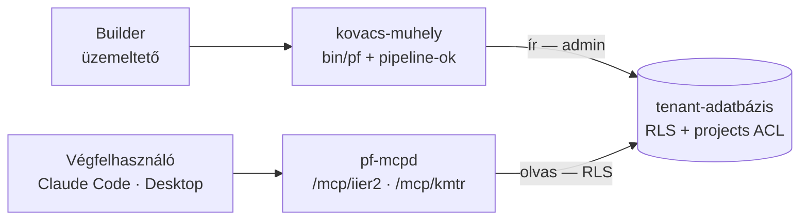
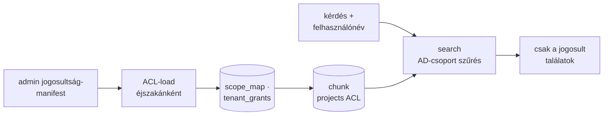

## :package: kovacs-muhely {layout=title}
A tudástárak builder-oldali eszköztára — pipeline-forge engine, tenantonkénti ingest-pipeline-ok, üzemeltetői szkriptek

## Két oldal, egy adatbázis — ki mit tesz? {layout=free diagrams=first diagram_style=storyboard highlight_path=B,KM,DB label="Pozicionálás" id=s2}



### :package: A toolkit — ez a repo {accent=lavender}
- Builder/üzemeltető használja
- Ingest, újraépítés, retrieval-QA a `bin/pf`-fel
- **Nincs saját MCP szervere** — a QA közvetlenül a kereső pipeline-t futtatja

### :users: A végfelhasználói oldal — iier-tudastar {accent=mauve}
- Távoli pf-mcpd tenant-útvonalak, nincs helyi szerver
- `/mcp/iier2` — 7 tool · `/mcp/kmtr` — 6 tool
- Csak olvas, AD-csoport kapuval

### :database: A közös backend {accent=green}
- Tenantonként saját adatbázis az éles szerveren
- Minden chunk hordozza a `projects[]` ACL-t
- Builder ír, végfelhasználó csak olvas

```notes
⏱ 1:30 — A legfontosabb mondat: a kovacs-muhely tölt, az iier-tudastar olvas, és a kettő között
egyetlen adatbázis van tenantonként. A végfelhasználó semmit nem telepít a saját gépére a
Claude-on kívül: a tool-ok a távoli pf-mcpd tenant-útvonalain élnek.
```

## Mi van a dobozban? {layout=cards label="A toolkit tartalma" id=s3}

### :cpu: Engine {accent=sapphire}
- `bin/pf` + `bin/pf.exe` — a pipeline-forge CLI
- Mindkettő ugyanabból a pipeline-forge commitból épül, commitolva
- A deploy-hosztnak nem kell Go

### :flow-arrow: Pipeline-ok {accent=mauve}
- 86 pipeline `.md` fájl, tenantonként mappában
- Ingest · kereső · wiki · eljárás-gráf · QA tool-ok
- Mind szerkeszthető, verziózott dokumentum

### :check-circle: Nincs Python {accent=green}
- A repóban egyetlen `.py` fájl sincs
- SharePoint, compact, LDAP: natív pf-adapterek
- Egy nyelv: a pipeline `.md`

---

### :hard-drives: Üzemeltetői szkriptek {accent=teal}
- `run_embed.sh` — egy pipeline futtatása a tenant env-jével
- `rag_status.sh` · `rag_counts.sh` — futások és chunk-számok
- `pre_deploy_check.sh` · `post_deploy_smoke.sh`

### :calendar: Ütemezés {accent=yellow}
- A pipeline fejlécének `schedule:` kulcsa a forrás
- A pf-worker az éles szerveren ütemez
- Éjszakai ablak, tenantonként eltolt idősávban

### :magnifying-glass: Retrieval-QA {accent=blue}
- `/km-search-iier2` — a kereső pipeline-t futtatja
- Embed után: „visszakereshető-e?”
- Builder-oldali ellenőrzés, nem éles felület

```notes
⏱ 3:00 — Három dolog számít: a bundle-olt pf (a host nem fordít), a pipeline-ok mint dokumentumok,
és hogy a repo teljesen Python-mentes — minden lépés pf-adapter.
```

## Tenantok — kik élnek ma? {layout=table label="Multi-tenancy" id=s4}

| Tenant | Mit tárol | Állapot |
|---|---|---|
| **iier2** | Confluence, JIRA, SharePoint, wiki, eljárás-gráf | éles |
| **kmtr** | ugyanaz a felállás, a iier2 mintájára | éles — bevezetés lezárva 2026-10-04 |
| belső IT-tudásbázis | Confluence, JIRA, web, GitLab, munkanapló | éles, saját adatbázissal |
| DWH-dosszié | felhasználói és leltár-dossziék | heti embed |
| **iier** (régi) | — | kivezetve, az útvonal lekapcsolva 2026-10-03 |

> :info: Egy tenant = egy saját adatbázis + egy `pipelines/<tenant>/` mappa + egy pf-mcpd útvonal. Új tenant adat és másolat, nem kód (lásd később).

```notes
⏱ 4:30 — A kmtr a iier2 másolata: ugyanaz a séma, ugyanazok a pipeline-ok, más scope. Ez a
multi-tenancy bizonyítéka — a második tenant nem kért egyetlen sor új kódot sem.
```

## Egy tenant pipeline-jai — iier2 / kmtr {layout=cards label="Pipeline-állomány" id=s5}

### :users: forge_ldap {accent=blue}
AD-tükör: a jogosultság-feloldó bemenete — ki melyik csoport tagja

### :list-checks: forge_jira {accent=blue}
Issue-ok delta-embed, projektenként `projects[]` scope

### :file-text: forge_confluence {accent=blue}
Registry-vezérelt oldalak, tér-szintű scope

### :stack: SP-crawl_site {accent=teal}
SharePoint v2: docx + xlsx, táblák EAV-ba, hierarchia-élek

---

### :package: forge_compact {accent=mauve}
Hasonló témák klaszterei — a `projects[]` a tagok uniója

### :graph: forge_cross_source_links {accent=mauve}
SharePoint ↔ Confluence `same_as` élek — kalibrálásig kikapcsolva

### :magnifying-glass: search_rag · search_compact {accent=green}
ACL-szűrt keresés a hívó felhasználó nevével

### :books: WIKI · ELJ · TOOL {accent=green}
Generált enciklopédia, eljárás-gráf, builder-QA tool-ok

```notes
⏱ 6:30 — Balról jobbra a forrásoktól a származtatott rétegig: előbb a jogosultság (LDAP), aztán a
három forrás, aztán ami ezekből épül (klaszter, élek), végül a kereső és a wiki.
```

## Hozzáférés — a jog a sorban él, nem az alkalmazásban {layout=free diagrams=first diagram_style=storyboard highlight_path=M,A,S,C,R,OK label="ACL" id=s6}



### :file-text: A forrás a manifest {accent=blue}
- A jogokat az admin rendszere exportálja — mi csak alkalmazzuk
- Az `ACL-load` éjszakánként betölti, saját, szűk loader-szerepkörrel

### :lock: A szűrés az adatbázisban {accent=teal}
- Minden chunk viszi a `projects[]` listát
- A keresés a hívó AD-csoportjaiból számolja a láthatót
- Ismeretlen hívó: csak a `_public` — zárt alapállás

### :shield: Nincs alapértelmezett scope {accent=green}
- Ismeretlen tér vagy projekt: a futás hibát ad, nem talál ki scope-ot
- A grant tulajdonosi döntés, adatként rögzítve

```notes
⏱ 8:30 — A jog nem az alkalmazás kódjában van, hanem minden sorban. Ugyanaz a lekérdezés két
felhasználónak két eredményt ad — és ezt az adatbázis dönti el, nem a kliens.
```

## SharePoint v2 — registry-vezérelt crawl, táblák mint adat {label="Forrás-mélyfúrás" id=s7}

### :stack: Mit csinál {accent=teal}
- A könyvtárakat a registry adja (a manifestből vetítve), nincs beégetett lista
- docx és xlsx; a táblázat-sorok `rag.document_eav`-ba kerülnek, a szövegben horgony jelöli a helyüket
- xlsx-lapok vékony összefoglalóként embedelődnek
- Hierarchia-élek a mappaszerkezetből — LLM-hívás nélkül

### :clock: Hol fut {accent=yellow}
- **Saját idősávban**, nem az éjszakai fő folyamatban
- Ok: a hosszú crawl kiéheztette a compact lépést — ezért külön vált
- Delta-alapú: változatlan dokumentum nem embedelődik újra

---

**Az első teljes crawl mérlege** (iier2, 2026-08-05):

--- {layout=stats}

### 21 432 {accent=blue}
dokumentum

### 437 110 {accent=teal}
hierarchia-él

```notes
⏱ 10:30 — A táblázat nem szövegként vész el: sorai adatként tárolódnak, és a keresőből pontos
értékre is rá lehet kérdezni. A crawl külön idősávja mérési tanulság, nem preferencia.
```

## Ütemezés — a pf-worker kezeli {layout=table label="Éjszakai menetrend" id=s8}

| Idő | Pipeline | Tenant |
|---|---|---|
| 22:45 · 23:00 | `acl_load` | kmtr · iier2 |
| 23:15 · 23:30 | `SP-crawl_site` | kmtr · iier2 |
| 01:30 | éjszakai embed — belső IT-tudásbázis | belső |
| 02:30 | `ops_iier2_nightly_embed` | iier2 |
| 03:30 | `ops_kmtr_nightly_embed` | kmtr |
| 06:00 | `ops_nightly_status_all` — reggeli összesítő | mind |
| 07:20 | `ops_nightly_watchdog_iier2` | iier2 + kmtr |

> :info: Az éjszakai folyamat forrásai delta-alapúak és egymást nem blokkolják: egy forrás hibája nem állítja meg a többit, sem a compact lépést. A worker életjelét egy 15 perces időzítő figyeli, a workeren kívül.

```notes
⏱ 12:00 — A sorrend logikus: előbb a jog (ACL), aztán a SharePoint külön, aztán a fő embed, végül a
reggeli összesítő és a watchdog — ami nem futott, az reggel már látszik.
```

## Embedding és keresés {layout=cards label="A modell" id=s9}

### :cpu: Egy modell {accent=sapphire}
- `snowflake-arctic-embed2` — az egyetlen embedding-modell
- A modellt a gyűjtemény adja (`rag.collection_model()`), nem a pipeline

### :hard-drives: GPU-pool {accent=teal}
- Több GPU-példány közös pool-ban, átállással
- Ugyanaz a pool szolgálja az embedet és az LLM-hívásokat

### :quotes: Magyar előtagok {accent=yellow}
- `[CÍM:][FEJEZET:]` · `[OLDAL:][TÉR:]` a chunk elején
- A cím és a hely a vektor része lesz

### :sparkle: Reranker — opcionális {accent=green}
- Cross-encoder, `rerank_provider` argumentummal kapcsolható
- Ha nem érhető el, a vektorsorrend marad — a keresés nem áll le

```notes
⏱ 13:30 — Egy modell, egy forrás a modell nevéhez: így nem fordulhat elő, hogy két pipeline más
modellel embedel ugyanabba a gyűjteménybe.
```

## Mindennapi munka {layout=split label="Üzemeltetői munkamenet" align=top id=s10}

### :play-circle: Futtatás {accent=blue}
```bash
# egy forrás újraépítése a tenant env-jével
./run_embed.sh forge_confluence_iier2
./run_embed.sh forge_jira_iier2
./run_embed.sh SP-crawl_site

# állapot és számok
./scripts/rag_status.sh
./scripts/rag_counts.sh
```

### :gear: Skill-ek a Claude Code-ban {accent=mauve}
- `/km-embed` · `/km-status` — futtatás és állapot
- `/km-nightly-status` · `/km-nightly-check` — az éjszaka eredménye
- `/km-search-iier2` — retrieval-QA
- `/km-deploy` — telepítés a manifest alapján
- `/km-ops-watch` · `/km-ops-bugs` · `/km-ops-test` — tenantonkénti monitorozás

```notes
⏱ 15:00 — A napi munka nagy része nem futtatás, hanem ellenőrzés: a reggeli összesítő és a
watchdog megmondja, mit kell kézzel újrafuttatni.
```

## Végfelhasználói kérés — egy forrástól a találatig {layout=flow label="Esettanulmány" id=s11}
„Ezt a teret is kereshetővé tennétek?” — a válasz adat, nem kódváltozás.

### :chat-circle-dots: Kérés
A felhasználó jelzi, mit keresne

### :file-text: Manifest
Az admin felveszi a jogosultság-manifestbe

### :list-checks: Registry
Az `acl_load` kivetíti a `rag.crawl_sources`-ba

### :clock: Éjszaka
A következő futás felveszi, delta-alapon

### :check-circle: Ellenőrzés {accent=green}
`rag_counts.sh` · `/km-search-iier2`

---

> :shield: **Idempotens.** A változatlan oldal tartalom-hash-e egyezik, újra nem embedelődik — csak az új tartalom kerül chunkolásra és GPU-hívásra.

```notes
⏱ 16:30 — Senki nem szerkeszt pipeline-t egy új forrásért. A forráslista adat, a jog az admin
exportjából jön, a következő éjszaka végzi a munkát.
```

## Új tenant — adat és másolat, nem kód {layout=flow label="Multi-tenancy" id=s12}
A kmtr így készült 2026 októberében — a iier2 felállásának másolataként.

### :database: Grant + routing
Egy migráció: `tenant_grants`, `scope_map` sorok

### :copy: Pipeline-mappa
`pipelines/<tenant>/` — a iier2 másolata

### :key: Env-kulcsok
Tenant-névtérrel, a vaultban

### :calendar: Menetrend
Éjszakai embed + watchdog listába

### :plug: MCP-útvonal
Új pf-mcpd tenant-route

### :package: Manifest-csomag {accent=green}
A jogosultság-export új csomagja

```notes
⏱ 18:00 — Hat lépés, egyik sem kód: egy migráció, egy mappamásolat, kulcsok, menetrend, útvonal,
manifest. Ez a „generikus motor, logika a specben” elv egy tenant szintjén.
```

## Számok — a kmtr az első héten {layout=stats label="Mérés" id=s13}

### 4 717
JIRA issue · 9 060 chunk (2026-10-02)

### 313
Confluence-oldal · 658 chunk (2026-10-02)

### 23 509
SharePoint-chunk 150 dokumentumból (2026-10-03)

### 30
AI-vázlat wiki-cikk (2026-10-02)

```notes
⏱ 19:00 — Valódi, dátummal rögzített számok a bevezetés naplójából. A 30 wiki-cikk AI-vázlat:
ember hagyja jóvá, mielőtt véglegesnek számít.
```

## Telepítés és migráció {layout=cards label="Setup" align=top id=s14}

### :rocket-launch: Deploy {accent=blue}
- `./deploy.sh <profil>` — a `deploy.manifest.yaml` alapján
- A telepítés is pipeline: `ops_deploy_km.md`
- Előtte `pre_deploy_check.sh`, utána `post_deploy_smoke.sh`

### :database: Migráció {accent=teal}
- Számozott SQL-fájlok, élő adatbázisra egyszerre egy
- A migrációs szkript `--dry-run` módja előbb
- Az `apply.sh` csak friss telepítésre — élő DB-t elutasít

### :cpu: A pf-bináris {accent=mauve}
- pipeline-forge-változás után **mindkét** binárist újra kell építeni
- Ugyanabból a commitból, a commit-üzenetben rögzítve

```notes
⏱ 20:30 — A telepítés sem kézi lépéssor: a manifest mondja meg, mi megy ki, a pipeline végzi, és
előtte-utána egy-egy ellenőrzés fut.
```

## Mit ad a builder-oldali toolkit? {layout=cards label="Összefoglalás" id=s15}

### :flow-arrow: Minden lépés dokumentum {accent=blue}
Pipeline `.md`-ben — nem kell Go- vagy Python-kódot módosítani

### :lock: A jog az adatban {accent=teal}
Soronkénti `projects[]` ACL, az admin manifestjéből

### :copy: Új tenant másolattal {accent=mauve}
Hat adat-lépés, nulla új kód — a kmtr a bizonyíték

### :eye: Reggel minden látszik {accent=green}
Összesítő + watchdog: ami éjjel nem futott, az reggel már jelez

```notes
⏱ 22:00 — Négy mondat, amit érdemes hazavinni: dokumentum a lépés, adat a jog, másolat a tenant,
és a csend nem siker — a watchdog reggel szól.
```
